# دیاگرام کلاس (نسخه‌ی نهایی فاز ۱)

این دیاگرام معماری پیاده‌سازی‌شده در پایان فاز ۱ است (نسخه‌ی اولیه‌ی فاز صفر پس از پیاده‌سازی، مطابق کد به‌روز شد).
معماری MVC است: `controller` (منوها و حلقه‌ی اصلی)، `model` (دامنه + سرویس‌ها)، `model.game` (موتور بازی) و `view` (تنها نقطه‌ی چاپ).

```mermaid
classDiagram
    %% ===== Application / controllers =====
    class GameApp {
        +run() void
    }
    class AppContext {
        -User currentUser
        -MenuType currentMenu
        +getAuthService() AuthService
        +getProfileService() ProfileService
        +getGreenhouseService() GreenhouseService
        +getShopService() ShopService
        +getQuestService() QuestService
    }
    class MenuController {
        <<abstract>>
        +handle(String rawInput) void
        #handleCommand(String) void*
        #allowedTargets() Set~MenuType~*
        #onExit() void*
    }
    class SignupMenuController
    class LoginMenuController
    class MainMenuController
    class GameMenuController {
        #GameSession session
        #handleSelectionCommand(String) void
        #applyOutcome(User) void
    }
    class MinigameMenuController
    class CollectionMenuController
    class SettingsMenuController
    class NewsMenuController
    class ProfileMenuController
    class GreenhouseMenuController
    class ShopMenuController
    class LeaderboardMenuController
    class TravelLogMenuController

    MenuController <|-- SignupMenuController
    MenuController <|-- LoginMenuController
    MenuController <|-- MainMenuController
    MenuController <|-- GameMenuController
    GameMenuController <|-- MinigameMenuController
    MenuController <|-- CollectionMenuController
    MenuController <|-- SettingsMenuController
    MenuController <|-- NewsMenuController
    MenuController <|-- ProfileMenuController
    MenuController <|-- GreenhouseMenuController
    MenuController <|-- ShopMenuController
    MenuController <|-- LeaderboardMenuController
    MenuController <|-- TravelLogMenuController
    GameApp --> AppContext
    GameApp --> MenuController
    MenuController --> AppContext
    MenuController --> ConsoleView

    %% ===== Users / services =====
    class User {
        -String username
        -String passwordHash
        -int difficulty
        -int coins
        -int diamonds
        -int levelsPassed
        -int maxMewPoints
        -int minigamesCompleted
        -int questsCompleted
        -Set~String~ unlockedPlants
        -Set~String~ observedZombies
        -Map~String,Integer~ seedPackets
        -List~GreenhousePot~ greenhousePots
        -Set~String~ storedBoosts
        -Map~String,String~ claimedQuests
        -Map~String,Integer~ minigameProgress
        -List~NewsItem~ news
    }
    class UserRepository {
        +add(User) void
        +findByUsername(String) User
        +all() List~User~
        +save() void
    }
    class AuthService
    class ProfileService
    class SessionStore
    class GreenhousePot {
        -boolean unlocked
        -String plantType
        -long readyAtMillis
    }
    class GreenhouseService {
        +plantPot(User, int x, int y) String
        +collect(User, int x, int y) String
        +grow(User, int x, int y) String
    }
    class ShopService {
        +list() List~String~
        +daily(User) List~String~
        +buy(User, String itemId, int count, String plantType) String
    }
    class Quest {
        -Priority priority
        -boolean daily
        +isMet(User, String today) boolean
        +grant(User) String
    }
    class QuestCatalog
    class QuestService {
        +lines(User, String page) List~String~
        +claim(User, String questId) String
    }
    class LeaderboardService {
        +table(Column sortBy, boolean ascending) List~String~
    }
    class NewsItem

    User "1" *-- "20" GreenhousePot
    User "1" *-- "*" NewsItem
    AuthService --> UserRepository
    ProfileService --> UserRepository
    GreenhouseService --> UserRepository
    ShopService --> UserRepository
    QuestService --> UserRepository
    QuestService --> QuestCatalog
    QuestCatalog *-- Quest
    LeaderboardService --> UserRepository

    %% ===== Game engine =====
    class GameSession {
        +advance(int ticks) void
        +plant(String type, int x, int y) String
        +pluck(int x, int y) String
        +feedPlant(int x, int y) String
        +collectSun(int x, int y) String
        +breakVase(int x, int y) String
        +placeZombie(String, int, int) String
        +startZombieWaves() String
        +isWon() boolean
        +isLost() boolean
        +drainEvents() List~String~
    }
    class Board {
        -TileTerrain[][] terrain
        -int[][] graveHp
        +rejection(PlantSpec, int, int) String
        +raiseGrave(int, int, String, boolean) void
        +slideIfOnIce(Zombie) void
    }
    class SunSystem {
        +tick(double dt, double seconds) void
        +producePlantSuns(GameSession) void
    }
    class WaveSystem {
        +tick(double seconds) void
        +allWavesSpawned() boolean
    }
    class PlantCombat {
        +tick() void
        +applyPlantFood(Plant) void
    }
    class ZombieAbilities {
        +tick(double dt) void
        +onDeath(Zombie) void
    }
    class SpecialLevelEngine {
        +tick(double seconds) void
        +startZombieWaves() String
    }
    class ScoreTracker {
        +onSpawn(Zombie, long tick) void
        +onKill(Zombie, long tick) void
        +breakdown() List~String~
    }
    class MinigameLogic {
        <<interface>>
        +init(GameSession) void
        +tick(GameSession, double) void
        +plantingRejection(int, int) String
        +onHouseReached(GameSession, Zombie) boolean
    }
    class VasebreakerGame
    class BowlingGame
    class IZombieGame

    GameSession *-- Board
    GameSession *-- SunSystem
    GameSession *-- WaveSystem
    GameSession *-- PlantCombat
    GameSession *-- ZombieAbilities
    GameSession *-- SpecialLevelEngine
    GameSession o-- ScoreTracker
    GameSession o-- MinigameLogic
    MinigameLogic <|.. VasebreakerGame
    MinigameLogic <|.. BowlingGame
    MinigameLogic <|.. IZombieGame
    GameMenuController --> GameSession

    %% ===== Entities and data =====
    class GameCatalog {
        +plant(String) PlantSpec
        +zombie(String) ZombieSpec
    }
    class PlantSpec {
        -String name
        -PlantCategory category
        -int sunCost
        -List~String~ tags
    }
    class ZombieSpec {
        -String name
        -int hp
        -Map~String,Integer~ armor
        -int waveCost
    }
    class Plant {
        -int hp
        -double attackCooldownSeconds
    }
    class Zombie {
        -int row
        -double x
        -int hp
        -Map~String,Integer~ armor
        +damage(int) boolean
    }
    class Sun {
        -Kind kind
        +isOnGround() boolean
    }
    class PlantCategory {
        <<enumeration>>
    }
    class TileTerrain {
        <<enumeration>>
    }

    GameCatalog *-- PlantSpec
    GameCatalog *-- ZombieSpec
    Plant --> PlantSpec
    Zombie --> ZombieSpec
    PlantSpec --> PlantCategory
    Board --> TileTerrain
    GameSession --> Plant
    GameSession --> Zombie
    SunSystem *-- Sun

    %% ===== Levels =====
    class Chapter {
        <<enumeration>>
    }
    class LevelSpec {
        -Chapter chapter
        -int day
        -int totalWaves
        -List~String~ zombiePool
        -Map~Integer,TileTerrain~ terrain
        -SpecialRules special
    }
    class SpecialRules {
        -Type type
        +conveyorBelt(...)$ SpecialRules
        +timedWar(...)$ SpecialRules
        +plantWhatYouGet(...)$ SpecialRules
    }
    class Levels {
        +adventure()$ List~LevelSpec~
        +byProgress(int)$ LevelSpec
        +scoreGame()$ LevelSpec
    }
    class Minigames {
        +start(String, int, int, List, Random)$ GameSession
    }

    Levels *-- LevelSpec
    LevelSpec --> Chapter
    LevelSpec o-- SpecialRules
    SpecialLevelEngine --> SpecialRules
    Minigames --> GameSession
    GameSession --> LevelSpec

    %% ===== View =====
    class ConsoleView {
        +info(String) void
        +error(String) void
        +showMap(GameSession) void
        +showZombiesInfo(List~Zombie~) void
        +showUserInfo(User) void
    }
```

## یادداشت‌های طراحی

- **الگوهای طراحی**: State (منوها با `MenuType` و `MenuController`)، Strategy (`ScoringPattern`های `ScoreTracker`، `MinigameLogic`، `SpecialRules` برای ۸ نوع مرحله‌ی ویژه)، Template Method (`MenuController.handle` و `GameMenuController.applyOutcome` که `MinigameMenuController` بازتعریفش می‌کند)، Factory (`Levels` و `Minigames`)، Singleton (`GameCatalog`).
- **داده‌محوری**: مشخصات گیاهان و زامبی‌ها در `resources/data/plants.csv` و `zombies.csv` است؛ افزودن گونه‌ی جدید بدون تغییر کد انجام می‌شود و رفتارهای خاص با تگ/نام در `PlantCombat` و `ZombieAbilities` سوار می‌شوند.
- **موتور تیک‌محور**: هر ثانیه ۱۰ تیک؛ `GameSession` هماهنگ‌کننده است و منطق در همکارهایش (`Board`، `SunSystem`، `WaveSystem`، `PlantCombat`، `ZombieAbilities`، `SpecialLevelEngine`، `MinigameLogic`) تقسیم شده تا محدودیت‌های لینتر (متد ≤ ۵۰ خط، کلاس ≤ ۵۰۰ NCSS) رعایت شود.
- **ذخیره‌سازی**: کل گراف `User` (کیف پول، گلخانه، کوئست‌ها، پیشرفت مینی‌گیم، اخبار) با Gson در `data/users.json` سریال می‌شود و بین اجراها می‌ماند.
