# دیاگرام کلاس اولیه (فاز صفر)

این دیاگرام معماری اولیه‌ی پیشنهادی برای فاز ۱ (نسخه‌ی CLI) است. طبق سند پروژه، این نقطه‌ی شروع طراحی است
و در حین پیاده‌سازی می‌تواند تغییر کند؛ جزئیات هر زیرسیستم (گیاهان، زامبی‌ها، مینی‌گیم‌ها و ...) به‌مرور که
پیاده‌سازی می‌شوند دقیق‌تر خواهند شد.

```mermaid
classDiagram
    %% ===== Application / CLI layer =====
    class Main {
        +main(args) void
    }
    class CommandDispatcher {
        -Map~String, CommandHandler~ handlers
        +dispatch(String rawInput) void
    }
    class SessionContext {
        -User currentUser
        -MenuManager menuManager
        -GameSession activeGame
    }

    Main --> CommandDispatcher
    CommandDispatcher --> SessionContext

    %% ===== Auth / User =====
    class User {
        -String username
        -String passwordHash
        -String nickname
        -String email
        -Gender gender
        -int difficultyLevel
        -Wallet wallet
        -PlayerStats stats
        -Inventory inventory
        -Set~String~ unlockedPlants
        -Set~String~ observedZombies
    }
    class Wallet {
        -int coins
        -int gems
    }
    class PlayerStats {
        -int gamesPlayed
        -int stagesCompleted
        -int highestMowPoint
        -int minigamesCompleted
        -int questsCompleted
    }
    class Inventory {
        -int plantFoodCount
        -Map~String, Integer~ seedPackets
        -int pots
    }
    class AuthService {
        +register(RegisterRequest) User
        +login(String username, String password) User
        +forgetPassword(String username, String email) SecurityQuestion
        +changePassword(User, String oldPw, String newPw) void
    }
    class SecurityQuestion {
        -int questionNumber
        -String answerHash
    }

    User "1" *-- "1" Wallet
    User "1" *-- "1" PlayerStats
    User "1" *-- "1" Inventory
    User "1" --> "1" SecurityQuestion
    AuthService --> User

    %% ===== Menu system =====
    class MenuManager {
        -Deque~Menu~ navigationStack
        +enter(Menu) void
        +exit() void
        +showCurrent() Menu
    }
    class Menu {
        <<abstract>>
        +handle(String command) void
    }
    class SignupMenu
    class LoginMenu
    class MainMenu
    class SettingsMenu
    class NewsMenu
    class ProfileMenu
    class CollectionMenu
    class PlantSelectionMenu
    class GreenhouseMenu
    class ShopMenu
    class TravelLogMenu
    class LeaderboardMenu

    Menu <|-- SignupMenu
    Menu <|-- LoginMenu
    Menu <|-- MainMenu
    Menu <|-- SettingsMenu
    Menu <|-- NewsMenu
    Menu <|-- ProfileMenu
    Menu <|-- CollectionMenu
    Menu <|-- PlantSelectionMenu
    Menu <|-- GreenhouseMenu
    Menu <|-- ShopMenu
    Menu <|-- TravelLogMenu
    Menu <|-- LeaderboardMenu
    MenuManager --> Menu

    %% ===== Core game engine =====
    class GameSession {
        -Board board
        -TimeManager timeManager
        -SunManager sunManager
        -WaveManager waveManager
        -List~Plant~ plantedPlants
        -List~Zombie~ zombies
        -int plantFoodAvailable
        +advanceTime(int ticks) void
        +isWon() boolean
        +isLost() boolean
    }
    class Board {
        -int rows
        -int cols
        -Tile[][] tiles
    }
    class Tile {
        -int x
        -int y
        -Plant plant
        -List~Zombie~ zombiesOnTile
        -boolean lawnMowerAvailable
        -TileTerrain terrain
    }
    class TimeManager {
        -long tickCount
        +tick() void
    }
    class SunManager {
        -int sunAmount
        -List~FallingSun~ fallingSuns
        +scheduleNextDrop() void
        +collectSun(int x, int y) void
    }
    class WaveManager {
        -int currentWave
        -int totalWaves
        -double waveDifficulty
        +startNextWave() void
        +spawnZombiesForWave() void
    }
    class LawnMower {
        -int row
        -boolean used
        +trigger() void
    }

    GameSession *-- Board
    GameSession *-- TimeManager
    GameSession *-- SunManager
    GameSession *-- WaveManager
    Board *-- Tile
    Board *-- LawnMower

    %% ===== Plants =====
    class Plant {
        <<abstract>>
        -String type
        -int level
        -int cost
        -int cooldownSeconds
        -Set~PlantTag~ tags
        +onPlanted(Tile) void
        +onTick() void
        +useFood() void
    }
    class SunProducerPlant
    class ShooterPlant
    class LobberPlant
    class ExplosivePlant
    class MeleeAttackerPlant
    class WallNutPlant
    class ModifierPlant
    class StrikeThroughPlant
    class HomingPlant
    class MintPlant

    Plant <|-- SunProducerPlant
    Plant <|-- ShooterPlant
    Plant <|-- LobberPlant
    Plant <|-- ExplosivePlant
    Plant <|-- MeleeAttackerPlant
    Plant <|-- WallNutPlant
    Plant <|-- ModifierPlant
    Plant <|-- StrikeThroughPlant
    Plant <|-- HomingPlant
    Plant <|-- MintPlant

    %% ===== Zombies =====
    class Zombie {
        <<abstract>>
        -String type
        -int health
        -List~ArmorPiece~ armorPieces
        -Map~String, Effect~ activeEffects
        +onTick() void
        +attack(Plant) void
    }
    class ArmorPiece {
        -String name
        -int health
    }
    class Gargantuar
    class Imp
    class RegularZombie
    class ChapterSpecificZombie

    Zombie *-- ArmorPiece
    Zombie <|-- Gargantuar
    Zombie <|-- Imp
    Zombie <|-- RegularZombie
    Zombie <|-- ChapterSpecificZombie

    GameSession --> Plant
    GameSession --> Zombie

    %% ===== Chapters / Levels =====
    class Chapter {
        -String name
        -List~Level~ levels
    }
    class Level {
        -int index
        -LevelType type
        +buildGameSession() GameSession
    }
    class SpecialLevel {
        -SpecialLevelKind kind
    }
    Level <|-- SpecialLevel
    Chapter *-- Level

    %% ===== Greenhouse =====
    class Greenhouse {
        -GreenhousePot[][] pots
        +plantPot(int x, int y) void
        +collect(int x, int y) void
        +grow(int x, int y) void
    }
    class GreenhousePot {
        -boolean unlocked
        -String growingPlantType
        -LocalDateTime readyAt
    }
    Greenhouse *-- GreenhousePot

    %% ===== Shop =====
    class Shop {
        -List~ShopItem~ permanentItems
        -DailyOffer dailyOffer
        +buy(String itemId, int count, String plantType) void
    }
    class ShopItem {
        -String id
        -int coinPrice
        -int gemPrice
    }
    class DailyOffer {
        -String plantType
        -LocalDate offerDate
        -boolean purchasedToday
    }
    Shop *-- ShopItem
    Shop *-- DailyOffer

    %% ===== Quests / Leaderboard =====
    class QuestManager {
        -List~Quest~ quests
        +checkProgress(User) void
    }
    class Quest {
        -QuestPriority priority
        -QuestReward reward
    }
    class Leaderboard {
        +topEntries(String sortBy, boolean ascending) List~LeaderboardEntry~
    }
    class LeaderboardEntry {
        -String username
        -String lastLevelReached
        -int minigamesCompleted
        -int questsCompleted
        -int highestMowPoint
    }
    QuestManager *-- Quest
    Leaderboard *-- LeaderboardEntry

    %% ===== Minigames =====
    class Minigame {
        <<abstract>>
        -int stageIndex
        +play() void
    }
    class Vasebreaker
    class WallnutBowling
    class IZombie
    class Bejeweled
    class Zombotany

    Minigame <|-- Vasebreaker
    Minigame <|-- WallnutBowling
    Minigame <|-- IZombie
    Minigame <|-- Bejeweled
    Minigame <|-- Zombotany

    %% ===== Persistence =====
    class PersistenceManager {
        +saveAllUsers(List~User~) void
        +loadAllUsers() List~User~
        +saveGameState(GameSession) void
    }
    PersistenceManager --> User
    PersistenceManager --> GameSession

    SessionContext --> User
    SessionContext --> GameSession
    SessionContext --> MenuManager
```

## یادداشت‌های طراحی

- **الگوهای طراحی مورد استفاده**: State (Menu/MenuManager برای پیمایش منوها)، Strategy (SpecialLevel، انواع مینی‌گیم، انواع الگوی امتیازدهی بازی امتیازی)، Template Method (چرخه‌ی تیک `Plant.onTick` / `Zombie.onTick`).
- **گیاهان و زامبی‌ها** به‌جای کلاس جدا برای هر مورد (که با ده‌ها گیاه/زامبی حجم کلاس را غیرقابل مدیریت می‌کند)، از ترکیب دسته‌بندی (کلاس پایه‌ی هر دسته) + تگ‌ها (به‌صورت `Set<PlantTag>` یا رفتارهای composable) استفاده می‌شود؛ مقادیر عددی (HP، آسیب، هزینه) از `plants.csv` / `zombies.csv` در زمان اجرا بارگذاری می‌شوند، نه هاردکد در کد.
- **PersistenceManager** روی Gson می‌ایستد و کل گراف `User` (شامل `Wallet`/`Inventory`/`PlayerStats`) و وضعیت جاری بازی را serialize می‌کند تا طبق سند، اطلاعات بین اجراهای برنامه باقی بماند.
- این دیاگرام «کلاس‌های اصلی و روابط سطح بالا» را نشان می‌دهد؛ فیلدها/متدهای کامل، به‌خصوص برای فصل‌ها، مراحل ویژه و مینی‌گیم‌ها، در حین پیاده‌سازی هر بخش دقیق‌تر می‌شوند.
